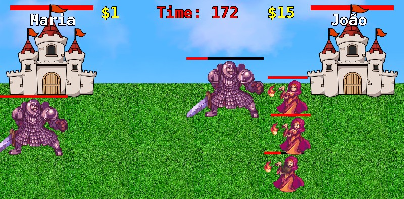
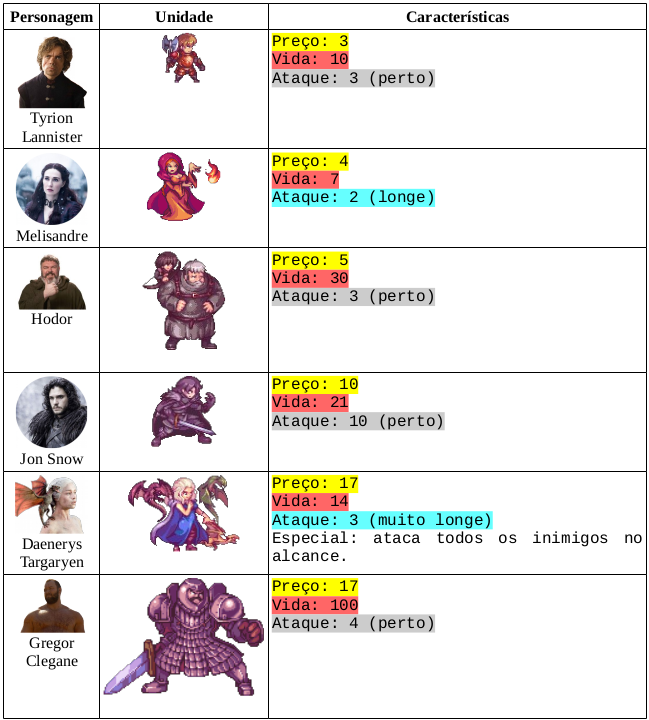
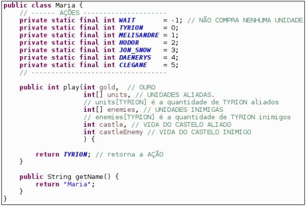

# 
<b>Desafio ACT Tecnologia</b>

> Este jogo foi utilizado durante a semana acadêmica de TSI do ano de 2017. Esta é uma mera reprodução do desafio para colaboradores da ACT Tecnologia.

## Informações do Arquivo do Jogo
* Versão: 1
* Desenvolvido em Java 8.
* Compatível com Windows, Linux e Mac.
* Tamanho: 8 MB.
* Para rodar o jogo, clique 2 vezes no arquivo JAR ou execute-o pelo terminal “java -jar
game.jar”. Existe um parâmetro opcional “fps”. Exemplo: “java -jar game.jar fps300”.

## Como Jogar
* O jogo sempre é jogado entre 2 jogadores, sendo um contra o outro.
* Cada jogador possui um castelo e o primeiro que destruir o castelo inimigo vence. Caso o
tempo acabe, o jogador com o castelo com mais vida vence. No caso de empate, os dois
jogadores perdem.
* Para atacar o inimigo, o jogador deverá comprar unidades para a Guerra. O jogador
deverá decidir somente quando e qual unidade comprar. Depois de comprar uma unidade,
ela se moverá e atacará sem interferência do jogador. O jogador com a melhor estratégia
vence.
* Os jogadores ganham peças de ouro conforme o tempo passa. Elas devem ser usadas para
comprar unidades.

# Unidades

# Programação do jogador

Abaixo, temos a classe do jogador padrão "Maria".

* O exemplo possui o mínimo necessário para jogar.
* As constantes servem para auxiliar a programação. Elas representam o resultado do método
“play”.
* Coloque o seu nome no método “getName”. Ele será exibido no jogo.
* O método “play” é onde ficará a estratégia do jogador. Ele recebe por parâmetro as
informações da guerra e, com base nelas, deve decidir se compra alguma unidade ou se
espera o próximo turno. Para não esperar, basta retornar “WAIT”.
* O valor retornado pelo “play” é a unidade que se deseja comprar. Ela só será comprada caso
o valor seja válido e o jogador tenha o ouro suficiente.
* O método “play” será chamado várias vezes por segundo.
* O jogo instancia um objeto da sua classe automaticamente, portanto você poderá criar
métodos e atributos na sua classe. O estado do objeto é preservado entre as chamadas do
método “play”.
* O código-fonte dos jogadores devem estar na pasta “players”.

## Proibições
* Não use o nome da sua classe no seu código, pois quando o jogo carregar a sua classe, ele
alterará o nome da classe. Exemplo do que não se deve fazer no código: Maria.atributo = 3;
* Não pode manipular processos ou threads.
* Não pode manipular arquivos ou acessar a rede.
* Não pode depender de bibliotecas externas. Use somente o que tem disponível no JDK.
* Não pode tentar obter informações do jogo ou de outros jogadores. Todas as informações
necessárias para o jogador serão passadas por parâmetro para o método “play”.
* Caso o código não compile, ele perderá a guerra.
* Caso o método “play” gere uma exceção (exemplo: NullPointerException), a ação do
jogador será desconsiderada.

## Competição

* Os jogadores poderão enviar o seu código-fonte pelo site divulgado internamente. Podem ser
enviadas várias vezes por dia. Será enviado somente um arquivo Java.
* O jogo é executado a cada hora do dia durante o horário convencional (das 9:00 as 17:00) no ~servidor~ computador do Peterson. Depois de executado, é gerado um
ranking com a classificação de cada aluno.
* Todos os jogadores jogarão contra todos. Quem ganhar um duelo, ganha um ponto na
classificação. A partir da pontuação é que será gerado o ranking.
* O ranking também é atualizado a cada hora, sendo assim caso um código enviado não suba no ranking, pode ser melhorado e enviado novamente para aguardar o resultado na proxima hora.
* Qualquer dúvida pode ser tirada diretamente com o Peterson.
